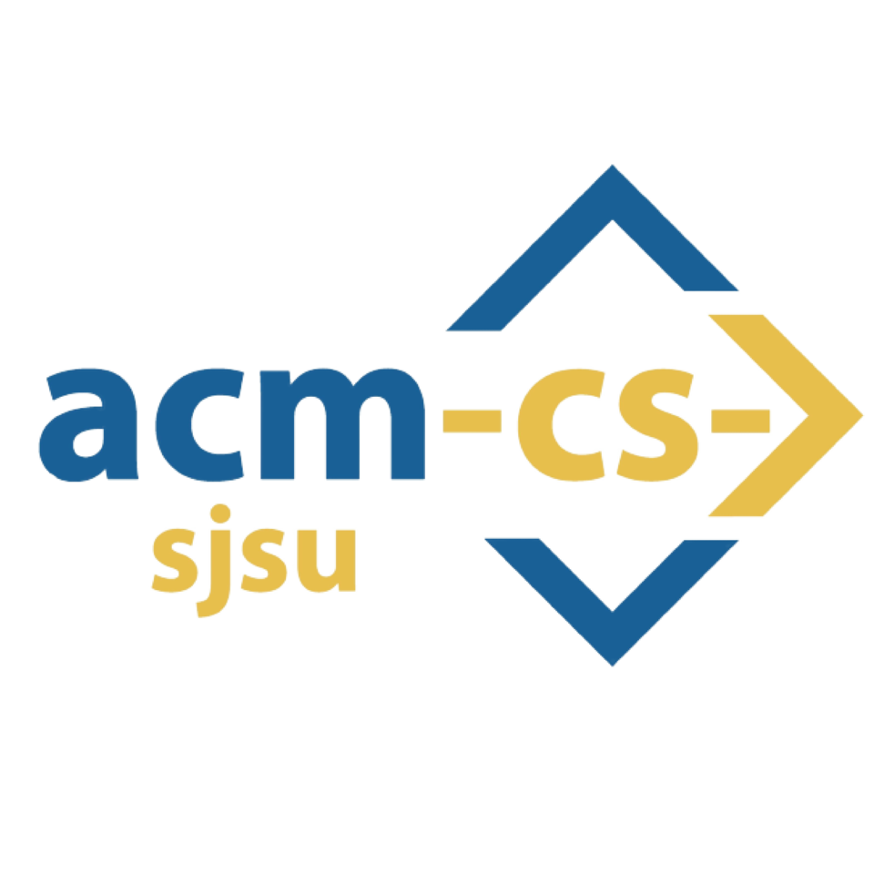

<!-- AUTO-GENERATED-CONTENT:START (STARTER) -->
<p align="center">
    
</p>
<h1 align="center">
  ACM at SJSU React.js with Gatsby Workshop
</h1>

Here's the code for the demo where we talk about how to create frontend React components
using TypeScript and Gatsby!

## 🚀 Quick start

1.  **Import required dependencies.**

    ```shell
    npm install -g typescript
    npm install -g gatsby-cli
    npm i lottie-react
    npm i styled-components
    npm install @mui/material @emotion/react @emotion/styled
    ```

1.  **Build the demo.**

    ```shell
    cd frameworks-demo/
    gatsby develop
    ```

1.  **View the site via your favorite browser.**

    Go to `http://localhost:8000`!

    Note: You'll also see a second link: `http://localhost:8000/___graphql`. This is a tool you can use to experiment with querying your data. Learn more about using this tool in the [Gatsby Tutorial](https://www.gatsbyjs.com/docs/tutorial/getting-started/part-4/#use-graphiql-to-explore-the-data-layer-and-write-graphql-queries).

